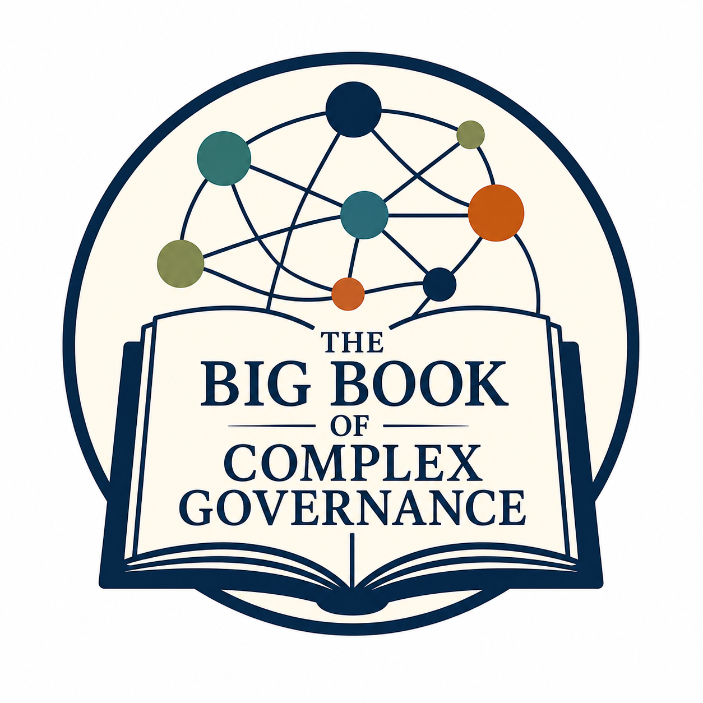

Welcome to the Big Book of Complex Governance 

We’re excited to see that you share our enthusiasm for the Big Book of Complex Governance! To keep the momentum from ASPA going, we’d love to continue building this initiative together.

## What is the Big Book of Complex Governance?

- **The challenge**: Research on complex governance can be difficult to navigate—resources are scattered, methods are complex, and theoretical approaches are diverse. Many of us end up working through similar challenges in isolation.

- **The goal**: To create a shared, open-source repository of resources that helps both current and future scholars overcome these barriers more efficiently.
If you’d like to learn more, you can view the ASPA presentation here.

## How can you get involved?

We encourage everyone to contribute. At ASPA, we began mapping out potential “chapters” for this book that you see to the left. Now, we invite you to review, refine, and expand on those themes and topics.

## Your Responses from the Last Outreach

1. First, do you have any thoughts (for or against) regarding the chapters/themes that were identified at ASPA?
   - **General Reception**: The identified chapters and themes are widely viewed as a strong and exciting foundation for the project.
   - **Refinements and Additions**: While the current structure is well-received, it is noted that the themes can be further enhanced, specifically by incorporating case studies that illustrate foundational concepts to effectively bridge theory with real-world application.

2. Second, what themes are missing from the list? Furthermore, are there subcategories that should be further split underneath any of the identified themes? (Please add as many as you see fit with a brief discription/discussion for each)
   - **Foundational Frameworks**: Organize foundational readings by intellectual disciplines (e.g., cybernetics, systems theory, relational sociology) to help scholars navigate theoretical variations, and include a dedicated section on the common paradigmatic assumptions shared across diverse network and governance conceptualizations.
   - **Practice and Impact**: Incorporate a chapter on "working with practice" that highlights how research connects to human well-being, risk management, and decision-making, while addressing ethical considerations such as transparency, accountability, and the impact of data collection in sensitive contexts.
   - **Methodological Expansion**: Expand the methods section to include Qualitative Comparative Analysis (QCA), Network Exposure Models, and specific discussions on simulations, while integrating case studies to illustrate practical applications.
   - **Community Engagement**: Add a dedicated framework for evaluating governance initiatives to support adaptive management and foster community-engaged approaches that ensure research results provide meaningful value to practitioners.
